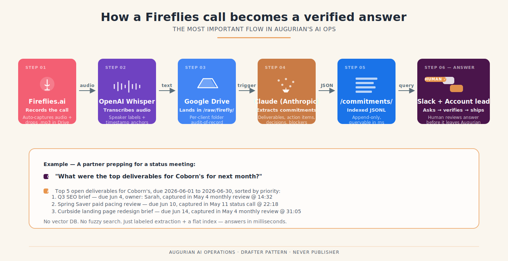
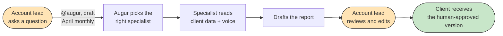
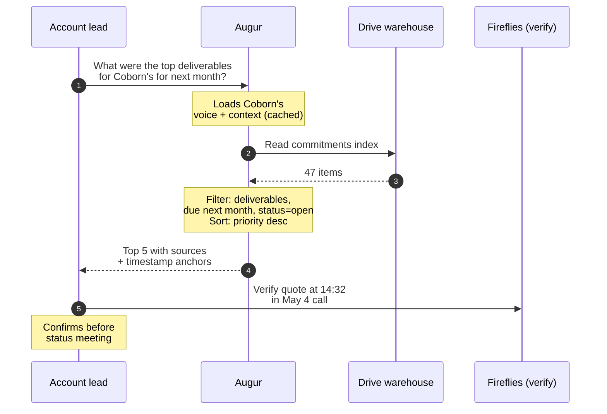
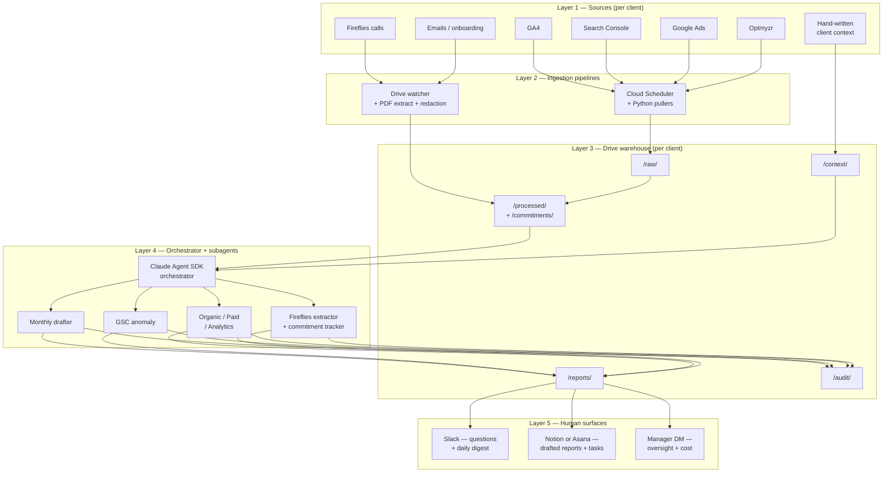
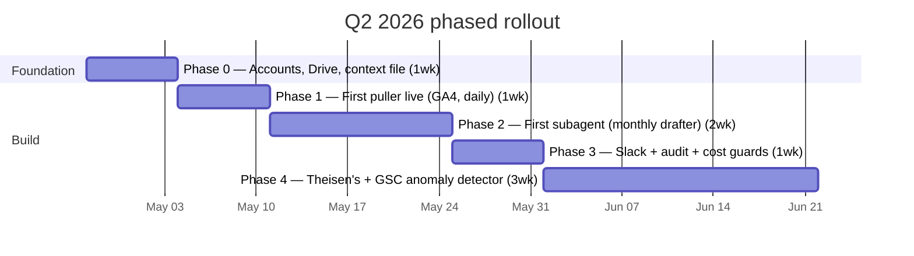

<div align="center">


# Augurian AI Operations

**Internal AI assistant for Augurian's marketing-ops work.**
*Drafts client reports. Spots anomalies. Triages recommendations. Never sends to clients without a human review.*

[](./docs/phases/) &nbsp;
[](./docs/IMPLEMENTATION_PLAYBOOK.md) &nbsp;
[](./docs/FOR_NON_TECHNICAL_READERS.md) &nbsp;
[](./pipelines/clients.example.yaml)

</div>

---

## ⭐ The flow that matters most

Every conversation Augurian has on a client call is captured by Fireflies. Most of those captures sit in a folder, unread. **This system reads them, extracts what was committed to, and lets a partner ask a question on Friday morning that gets a real answer in seconds — sourced back to the exact moment in the call where the commitment was made.**

<div align="center">

<a href="docs/images/fireflies-flow-hero.svg">
  
</a>

</div>

[](https://fireflies.ai)
[](https://drive.google.com)
[](https://www.anthropic.com)
[](#)
[](https://slack.com)
[](./docs/FOR_NON_TECHNICAL_READERS.md)

**Why this is the headline flow:** every other capability in this system is in service of this one. The monthly report drafter, the Optmyzr triage, the GSC anomaly detector — they all matter, but none of them answer the question Augurian leadership actually asks before a status meeting: *"what did we commit to, and what's coming up?"*  This flow does, and it does it without a vector database, without fuzzy search, and without any inference layer that could make something up. The labeling convention IS the query interface.

> Read the technical detail in [`docs/HOW_IT_WORKS.md`](./docs/HOW_IT_WORKS.md#how-a-fireflies-call-becomes-an-answer-to-a-leadership-question), the extraction rules in [`.claude/skills/fireflies-extraction-rules/`](./.claude/skills/fireflies-extraction-rules/SKILL.md), and the labeling convention in [`.claude/skills/commitment-labeling/`](./.claude/skills/commitment-labeling/SKILL.md).

---

## What is this, in plain English

A safe AI assistant for Augurian's team. It reads each client's data, drafts the work, and hands the draft to a human at Augurian. The human edits and decides what the client sees. **The AI never reaches the client directly.**

It's not a content generator. It's not a chatbot. It's a way to take the time-consuming-and-mechanical parts of an account lead's work — pulling data, writing first drafts, checking for unusual numbers — and shrink them, so the time-consuming-and-strategic parts (relationships, judgment, calls) get more room.

**For:** Augurian partners, account leads, paid specialists, SEO specialists.
**Pilot clients:** Coborn's first, Theisen's second.

## How it works in 60 seconds



The orange boxes are humans. The green box is the client. Everything between is automation. Every external output passes through a human review.

## What's in the stack

[](https://www.anthropic.com)
[](https://drive.google.com)
[](https://slack.com)
[](https://notion.so)
[](https://asana.com)
[](https://analytics.google.com)
[](https://search.google.com)
[](https://ads.google.com)
[](https://optmyzr.com)
[](https://fireflies.ai)
[](https://cloud.google.com/run)
[](https://www.python.org)

## A worked example: "What were the top deliverables for Coborn's for next month?"

This is the kind of question Augurian leadership asks before a status meeting. The system answers it in seconds, with sources you can verify.



Sarah's answer arrives looking like:

> *Top 5 open deliverables for Coborn's, due 2026-06-01 to 2026-06-30:*
>
> 1. **Q3 SEO brief** — due Jun 4, owner: Sarah, captured in May 4 monthly review @ 14:32
> 2. **Spring Saver paid pacing review** — due Jun 10, owner: Mike (Augurian), captured in May 11 status call @ 22:18
> 3. **Curbside landing page redesign brief** — due Jun 14, owner: Sarah, captured in May 4 monthly review @ 31:05
> 4. *…*
> 5. *…*

No vector database. No fuzzy search. No inference layer. The system extracts commitments from Fireflies transcripts as they're recorded, indexes them in plain JSON, and answers in milliseconds.

## Where to start, by audience

<table>
<tr>
<th width="33%">Augurian partners / leadership</th>
<th width="33%">Account leads / specialists</th>
<th width="33%">Engineers / contractors</th>
</tr>
<tr>
<td>

**[Plain-English entry](./docs/FOR_NON_TECHNICAL_READERS.md)** — what this is, who it's for, what to read next.

[Glossary](./docs/GLOSSARY.md) — every term decoded.

[Implementation Playbook](./docs/IMPLEMENTATION_PLAYBOOK.md) — the consultant's brief.

[Adoption Plan](./docs/ADOPTION_PLAN.md) — the team rollout.

[KPI Playbook](./docs/KPI_PLAYBOOK.md) — what success looks like.

[Leadership Brief template](./docs/LEADERSHIP_BRIEF.md) — partner-facing status.

[Vendor Management](./docs/VENDOR_MANAGEMENT.md) — managing the technical builder.

</td>
<td>

**[Training Guide](./docs/TRAINING_GUIDE.md)** — what Augur is good at, what it's bad at, how to ask good questions.

[Glossary](./docs/GLOSSARY.md) — every term decoded.

[Client context template](./context_templates/client_context_template.md) — the 2-hour interview that makes the system work.

[Disclosure worksheet](./docs/CLIENT_DISCLOSURE_WORKSHEET.md) — per-client AI-disclosure stance.

</td>
<td>

**[CLAUDE.md](./CLAUDE.md)** — coding conventions and locked-in decisions.

[Phase checklists](./docs/phases/) — week-by-week deliverables.

[Tooling: MCP](./docs/TOOLING_MCP.md) · [Cloud Run](./docs/TOOLING_CLOUD_RUN.md) · [Pipelines](./docs/TOOLING_PIPELINES.md)

[External resources](./docs/EXTERNAL_RESOURCES.md) — what to pull from Anthropic + community.

[`orchestrator/main.py`](./orchestrator/main.py) — entry point.

[`pipelines/ga4_puller.py`](./pipelines/ga4_puller.py) — canonical pipeline pattern.

</td>
</tr>
</table>

---

## Architecture

The five-layer architecture, with explicit data pipelines:

<div align="center">
  
</div>



Layer-by-layer breakdown in [`docs/architecture/README.md`](./docs/architecture/README.md). Visual deep-dive in [`docs/HOW_IT_WORKS.md`](./docs/HOW_IT_WORKS.md).

## Q2 2026 rollout



Each phase produces a real, reviewable deliverable before the next starts. Per-phase checklists in [`docs/phases/`](./docs/phases/).

## What's NOT in scope for Q2

- **No fine-tuning.** Claude as-is.
- **No client-facing tools.** Augurian-internal only.
- **No vector DB / RAG.** Data lives in Drive; the agent reads files directly.
- **No multi-tenant SaaS.** Built for Augurian, not for resale.
- **No agent autonomy past drafting.** Every external output is human-reviewed.

## Decisions that need leadership sign-off before week 1

- [ ] **Notion or Asana?** Pick one; don't run both.
- [ ] **Owner of the Google Cloud project, Anthropic API key, and Slack bot identity** — recommend a dedicated `ai-ops@augurian.com` Workspace user.
- [ ] **Builder identity** — internal hire, contractor, or consultant.
- [ ] **Q2 budget envelope** — engineering time + ~$200/mo AI + ~$50/mo tooling.
- [ ] **Client-AI disclosure** — does Coborn's know AI is in the loop? Worksheet at [`docs/CLIENT_DISCLOSURE_WORKSHEET.md`](./docs/CLIENT_DISCLOSURE_WORKSHEET.md).

---

## Subagents and skills

Two roles in `.claude/agents/`:

**Production specialists** — loaded by the orchestrator at runtime:

| Agent | Job |
|---|---|
| `monthly-report-drafter` | Drafts monthly client performance reports |
| `gsc-anomaly-detector` | Daily Search Console anomaly check (Haiku) |
| `organic-search` | SEO briefs, technical audits, GSC analysis |
| `paid-media` | Pacing checks, ad copy, Optmyzr triage |
| `analytics` | Cross-channel analytics, ad-hoc questions |
| `fireflies-extractor` | Extracts deliverables/decisions from call transcripts |
| `commitment-tracker` | Answers "what's coming up for X?" / "what does Augurian owe Y?" |

**Dev helpers** — for engineers and account leads working in Claude Code:

| Agent | Job |
|---|---|
| `pipeline-engineer` | Build/maintain the scheduled pullers |
| `mcp-integrator` | Wire and debug MCP server connections |
| `agent-architect` | Design new specialist subagents |
| `audit-reviewer` | Read audit logs, summarize daily activity |
| `drive-warehouse-curator` | Audit folder structure, fix permission drift |
| `drive-data-architect` | Design Drive structure, naming conventions, query paths |
| `client-onboarder` | Walk through Phase 0 for a new client |
| `cost-monitor` | Watch token + GCP spend; flag outliers |
| `ga4-data-expert` | GA4 metric semantics, healthy ranges |
| `context-coach` | Help account leads write `client_context.md` (interview-only) |
| `report-reviewer` | Capture edit patterns; recommend context-file updates |
| `git-workflow` | Repo's git steward |
| `code-reviewer` | Reviews PRs against this repo's specific concerns |
| `secret-scanner` | Pre-push scan for leaked tokens / keys |
| `adoption-coach` | Watches adoption signals; intervenes on drops |
| `leadership-briefing` | Drafts the weekly partner brief |
| `training-designer` | Designs role-specific onboarding |
| `kpi-tracker` | Computes weekly KPIs |
| `change-comms` | Drafts internal Augurian comms |
| `vendor-manager` | Helps non-technical leadership manage the builder |
| `ai-literacy-coach` | Plain-English answers about the system |
| `readme-curator` | Owns the public-facing README |
| `diagram-designer` | Designs mermaid diagrams for non-technical readers |

**Reusable agent skills** in `.claude/skills/`:

- `drive-warehouse` — folder structure, where to read/write
- `ga4-glossary` — metric/dimension definitions
- `slack-formatting` — channel routing, length limits, mrkdwn
- `pii-redaction` — what gets redacted, what to flag
- `augurian-voice` — house voice, words to avoid
- `conventional-commits` — commit message format
- `git-safety` — destructive-op rules
- `fireflies-extraction-rules` — what to extract from call transcripts
- `commitment-labeling` — naming and index conventions
- `cli-data-tools` — `jq` / `csvkit` / `rclone` one-liners

For more agents and skills published by Anthropic and the community, see [`docs/EXTERNAL_RESOURCES.md`](./docs/EXTERNAL_RESOURCES.md).

## Repository layout

```
.
├── ARCHITECTURE.svg            # Top-level five-layer diagram
├── README.md                   # This file
├── CLAUDE.md                   # Engineer instructions for Claude Code
├── docs/                       # Audience-tracked docs (non-technical, technical, tooling)
├── orchestrator/               # Claude Agent SDK app (Python)
├── pipelines/                  # Scheduled puller scripts (one per source)
├── context_templates/          # Starter template for /context/client_context.md
├── examples/                   # Worked examples + test fixtures
├── .claude/
│   ├── agents/                 # 24 subagent definitions
│   ├── skills/                 # 10 reusable agent-skills
│   └── settings.json           # Permission allowlist for the dev environment
├── .pre-commit-config.yaml     # ruff, detect-secrets, large-file guard
├── .gitmessage                 # Conventional Commits template
├── pyproject.toml
├── .env.example
└── .gitignore
```

## Getting started (for engineers)

```bash
git clone https://github.com/JohnRiceML/augurian-ai-operations.git
cd augurian-ai-operations
python -m venv .venv && source .venv/bin/activate
pip install -e ".[dev]"
pip install pre-commit && pre-commit install
git config commit.template .gitmessage

cp .env.example .env                                    # fill in secrets
cp pipelines/clients.example.yaml pipelines/clients.yaml  # add real client IDs

python -m pipelines.ga4_puller --client coborns --days-ago 1 --dry-run   # smoke test
```

Then walk [`docs/phases/phase-0-foundation.md`](./docs/phases/phase-0-foundation.md) end-to-end.

## License

Proprietary. Internal Augurian use only.

---

<div align="center">

*Built for Augurian by [Next Gen AI LLC](https://next-gen-ai.com).*
*Status: Phase 0 starter. Q2 2026 pilot.*

</div>
