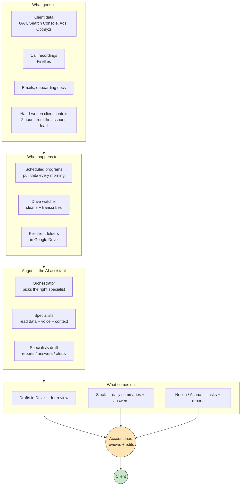
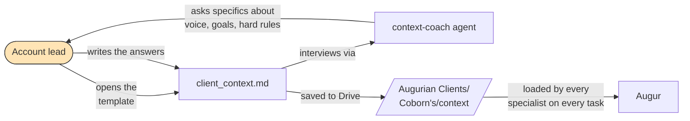
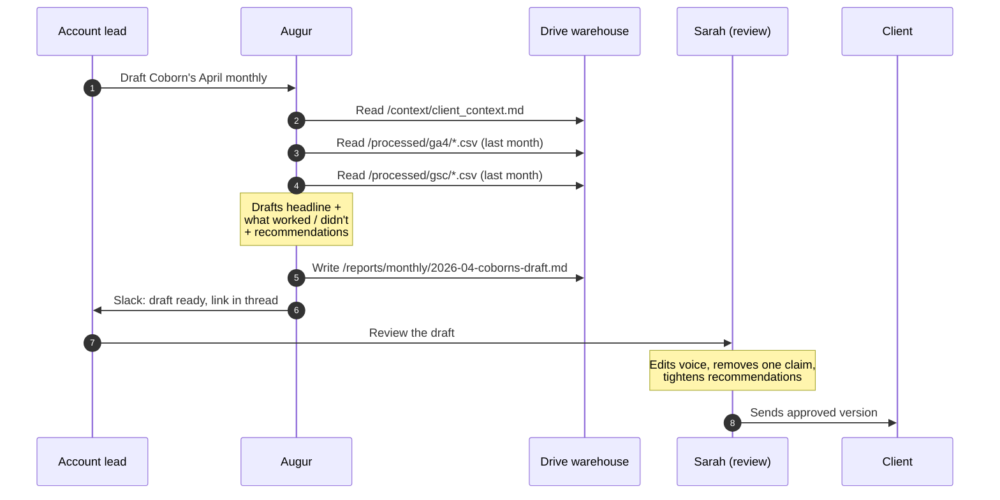
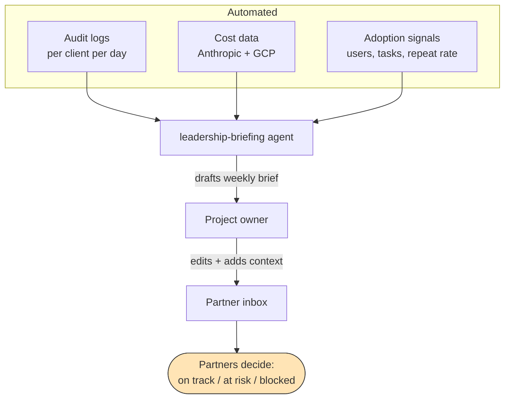
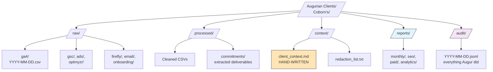
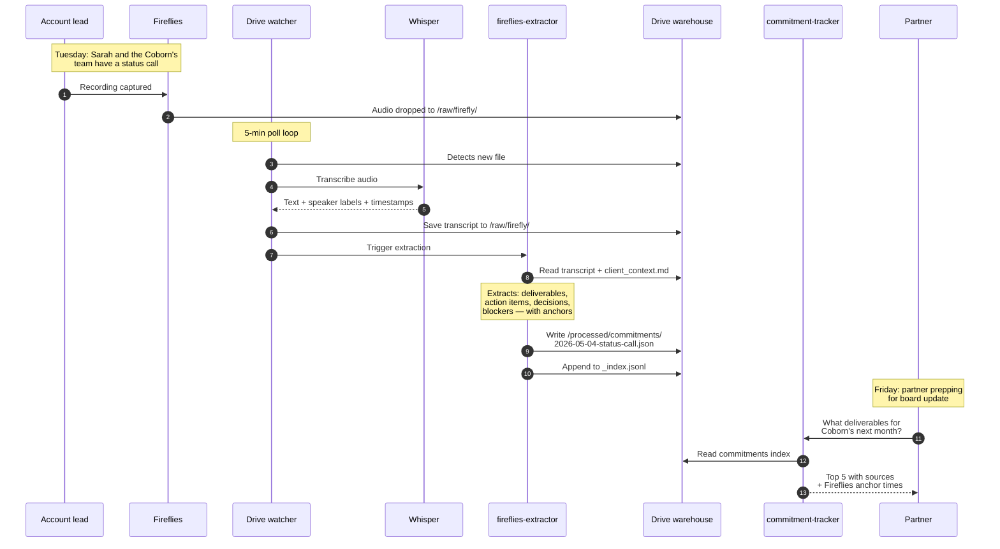
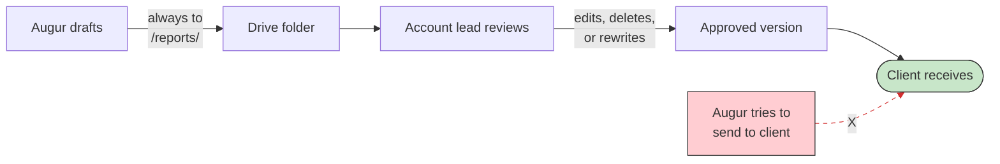
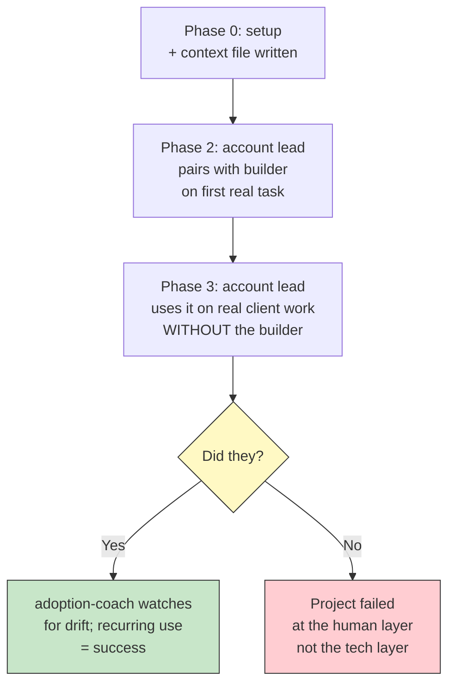

# How it works

Visual deep-dive — for partners, account leads, or anyone who's read the README and wants to see *more* of how the pieces fit together. No code in this doc; it's all diagrams and plain English.

The architecture diagram is at [`../ARCHITECTURE.svg`](../ARCHITECTURE.svg) — open it in any browser for the full-resolution version.

## The big picture, one diagram

The orange box is where humans do the work that only humans can do. The green box is the client — they only ever see human-approved output.

## The three things Augurian people do

### 1. Account leads write the context file (~2 hours, once per client)

This is where the system gets its voice. Without it, every report sounds the same; with it, every report sounds like Augurian-for-this-specific-client.

The `context-coach` agent doesn't write the context file. It interviews the account lead so the answers come out organized. AI-generating this file would defeat the entire system.

### 2. Specialists work on real client tasks

A specialist (account lead, paid manager, SEO lead) asks Augur for help with a specific task. The right subagent picks it up.

Augur drafts in 60 seconds what would take Sarah 90 minutes. Sarah's hour of edits + judgment is the part that makes it good.

### 3. Leadership reads the weekly brief

The project owner (and partners) don't use Augur day-to-day. They read the weekly brief to know if it's working.

5-minute read. Three sentences carry it: status, who used it, cost vs budget.

## The data warehouse, demystified

Each Augurian client gets one folder in a shared Google Drive. The structure is identical across clients.

| Folder | What's in it | Who writes it |
|---|---|---|
| `/raw/` | Daily exports + manual dumps | Pipelines (automated) |
| `/processed/` | Cleaned, deduped, PII-stripped | Drive watcher (automated) |
| `/context/` | Voice, goals, hard rules | Account lead (by hand) |
| `/reports/` | Drafted deliverables for review | Augur subagents |
| `/audit/` | Daily log of everything Augur did | Audit hook (automated) |

## How a Fireflies call becomes an answer to a leadership question

This is the system's most ambitious flow — and the one that earns its keep.

The trick: at no point does the system "think" about the question. It extracts on capture, indexes flat JSON, and answers by filtering. No vector DB, no embeddings, no fuzzy matching. Just: what's in the index, when's it due, who owns it, where can I verify.

That's the architectural decision that keeps cost low and accuracy high.

## How safety works (the drafter pattern)

Three guardrails, none of them new ideas — but all three together.

| Guardrail | What it does | Where it's enforced |
|---|---|---|
| **No publish path** | Augur literally has no tool that talks to a client | `orchestrator/tools/permissions.py` — the agent's tool surface doesn't include a "send email" or "post externally" tool |
| **Always-write-to-`/reports/`** | Every draft lands in a review queue, not in an outbound channel | The subagent system prompts; reinforced in the code-review agent |
| **Audit log everything** | Every action is recorded; review-able for any client at any time | `orchestrator/hooks/audit_log.py` |

If a future Augurian engineer ever proposed adding a "send to client" tool, the `code-reviewer` agent's first action would be to block the PR.

## How adoption is supposed to work

The technical work is straightforward. The adoption work is where this either succeeds or fails.

The decision point at the end of Phase 3 is the project's actual moment of truth. The technology doesn't matter if it's not used.

The adoption-coach agent's whole job is watching for that signal and intervening *before* the answer to "did they?" turns into "no."

## Where to go next

| If you want… | Read |
|---|---|
| The plain-English overview | [`FOR_NON_TECHNICAL_READERS.md`](./FOR_NON_TECHNICAL_READERS.md) |
| Term-by-term explanations | [`GLOSSARY.md`](./GLOSSARY.md) |
| The week-by-week plan from the team's perspective | [`ADOPTION_PLAN.md`](./ADOPTION_PLAN.md) |
| The consultant's source-of-truth doc | [`IMPLEMENTATION_PLAYBOOK.md`](./IMPLEMENTATION_PLAYBOOK.md) |
| What "good" looks like by phase (for managing the builder) | [`VENDOR_MANAGEMENT.md`](./VENDOR_MANAGEMENT.md) |
| How we measure success | [`KPI_PLAYBOOK.md`](./KPI_PLAYBOOK.md) |
